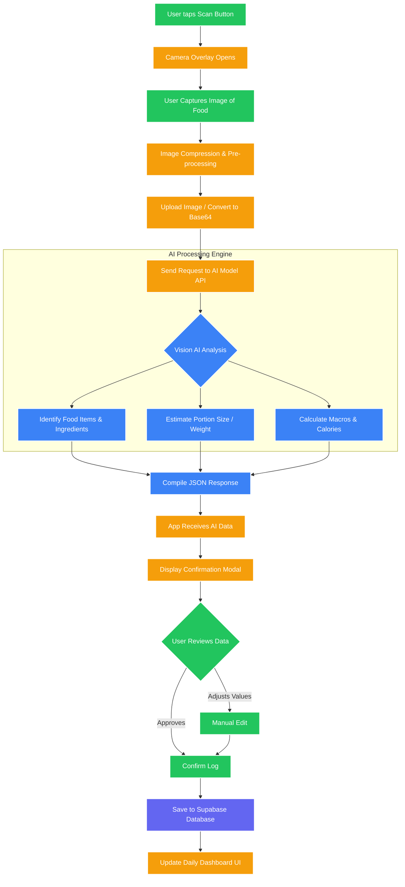

# AI Workflow Diagram

This document illustrates the step-by-step process of the core AI Food Scanning feature within the application.

## Description of Flow
1. **Capture:** The user initiates the camera via the floating action button and captures an image.
2. **Pre-processing:** The app compresses the image to ensure quick upload times and minimal payload size.
3. **AI Inference:** The image is passed to a Vision AI model which is prompted to identify the food, estimate its volume, and return a structured JSON mapping of calories, protein, carbs, and fats.
4. **Validation:** The AI's estimations are presented to the user. The user can either accept them directly or make manual tweaks if the AI was slightly off.
5. **Persistence:** The final approved nutrition data is logged to the user's daily record in the Supabase backend.
